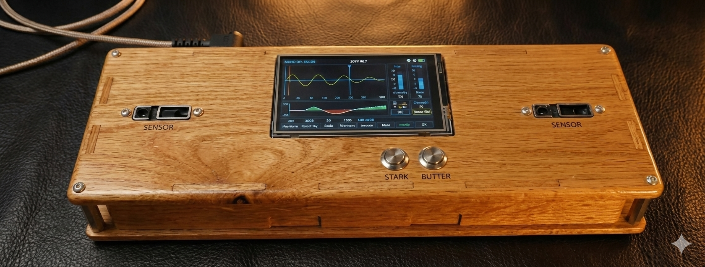
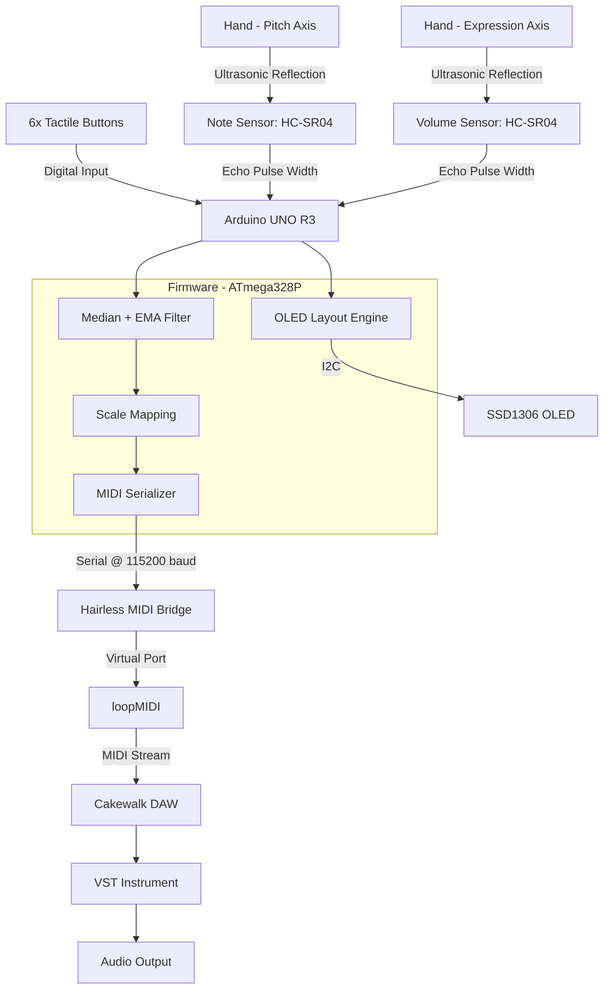
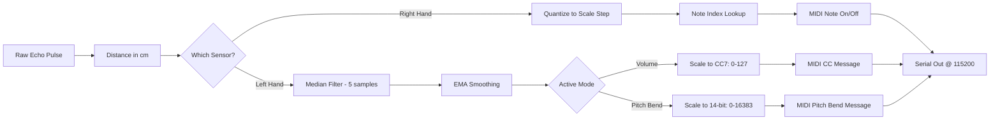
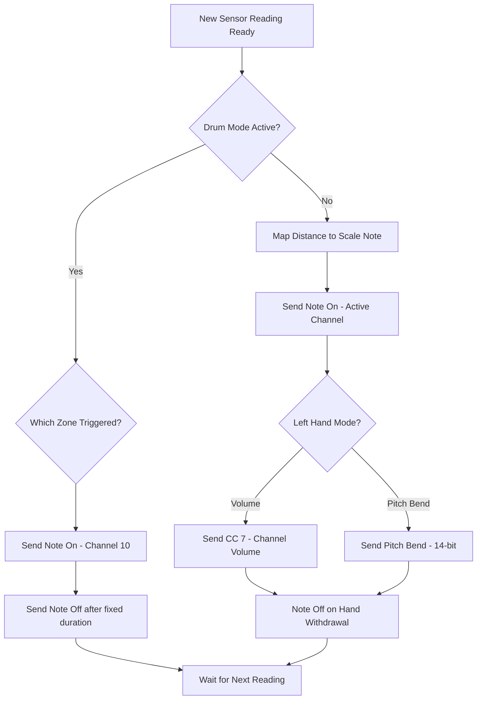
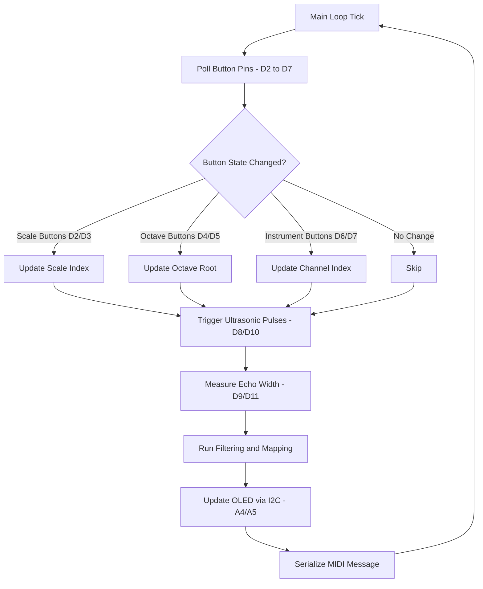

# MIDI Theremin Controller

<!-- IMAGE PLACEHOLDER: Hero Banner -->
<p align="center">
  
  <br><sub>Replace with a wide shot of the build, ideally mid-performance.</sub>
</p>

A gesture-controlled, contact-free MIDI controller. Move your hands in the air, an Arduino tracks them with ultrasonic sensors, and the result comes out as real MIDI — playable through any DAW, on any virtual instrument.

 Awarded **First Prize** at the IEEE Project Expo.

---


##  Why This Exists


This project started from a random reel.

I came across a video of someone playing a theremin and was immediately fascinated by the idea of controlling music without touching an instrument. After spending some time learning how traditional theremins worked, a different idea came to mind:

**What if I could build one that could play actual instruments instead of just electronic tones?**

That question led me down a rabbit hole of MIDI communication, sensors, and digital music systems.

Around the same time, we were required to build a mini-project for college, so my teammates and I decided to turn the idea into reality. What followed was a lot of experimentation, debugging, and late-night problem solving.

The first successful note, the first MIDI connection, and the first time a virtual instrument responded to a hand gesture were all moments that made the effort worth it.

What started as a simple idea from a reel eventually became a fully functional MIDI Theremin and later went on to win **First Prize at the IEEE Project Expo**.


---

## Overview

A traditional theremin generates its own audio waveform directly, through analog heterodyning oscillators — move your hand, the pitch changes, that's the whole instrument. This project takes a different approach: instead of generating sound itself, it acts as a **MIDI controller**.

Two ultrasonic sensors track hand position and convert that into MIDI messages, which get routed into a DAW running any virtual instrument:

* **Right Hand (Pitch Axis):** controls note selection — distance maps to discrete steps within whichever scale is active.
* **Left Hand (Expression Axis):** controls either MIDI CC 7 (volume) or pitch bend, depending on the loaded instrument patch.

An onboard OLED shows the active scale, octave, instrument, MIDI channel, both sensor distances, and the current output value, so you can see what's actually being sent without guessing. Six tactile buttons let you change octave, scale, and instrument mid-performance.

---

##  Features

## ✨ Features

* Contactless MIDI music control
* Multiple instrument modes
* Four musical scales
* Volume & pitch bend control
* Drum mode
* Melody playback modes
* OLED status display
* DAW integration

---

##  Demo

<!-- IMAGE PLACEHOLDER: Project Demo GIF -->
<p align="center">
  
  <br><sub>Replace with a short loop of a hand gesture producing a note end-to-end.</sub>
</p>

<!-- VIDEO PLACEHOLDER: Project Demo Video -->
>  **Full demo video:** replace this line with a YouTube/Drive link to the complete performance walkthrough.

---

## System Architecture



### Data Flow



### MIDI Communication Flow



### Hardware Interaction Flow



---

## Hardware Configuration

| Component | Quantity | Purpose | Specification |
|---|---|---|---|
| **Arduino UNO R3** | 1 | System processing, UART communication, sensor interface | ATmega328P, 16MHz, 5V |
| **HC-SR04 Ultrasonic Sensors** | 2 | Hand distance acquisition (Right: pitch, Left: expression) | 2cm–400cm range, 15° beam angle |
| **SSD1306 OLED Display** | 1 | Real-time visual telemetry | 128×64, 0.96", I2C |
| **Tactile Push Buttons** | 6 | Scale, octave, and instrument control | Standard 4-pin tactile switches |
| **Breadboard & Jumper Wires** | — | Prototyping and interconnects | Solderless breadboard |
| **USB Type A-B Cable** | 1 | Power + serial telemetry | Standard 1.5m |

---

##  Software Stack & Libraries

| Software / Library | Version / Source | Purpose |
|---|---|---|
| **Arduino IDE** | v2.x or later | Firmware compilation and upload |
| **Embedded C/C++** | Standard | Logic, signal processing, low-level drivers |
| **U8g2 Library** | Oliver Kraus (v2.x) | Monochrome OLED driver, page-buffered rendering |
| **Wire Library** | Built-in | I2C communication for the OLED |
| **avr/pgmspace** | AVR Toolchain | Storing scale tables, names, and songs in Flash |
| **Hairless MIDI** | v0.4 / open-source | Bridges serial output to a virtual MIDI port |
| **loopMIDI** | Tobias Erichsen | Creates a virtual MIDI loopback port on Windows |
| **Cakewalk DAW** | BandLab | Hosts the VST instruments that actually make sound |

---

## Wiring & Schematic

All grounds share a common rail. Buttons use the Arduino's internal pull-ups (`INPUT_PULLUP`), so each input reads LOW when pressed.

### Connection Table

| Device | Device Pin | Arduino Pin | Notes |
|---|---|---|---|
| **Note Sensor (Right Hand)** | VCC | 5V | Power |
| | GND | GND | Ground |
| | TRIG | D8 | Trigger pulse out |
| | ECHO | D9 | Echo pulse in |
| **Volume Sensor (Left Hand)** | VCC | 5V | Power |
| | GND | GND | Ground |
| | TRIG | D10 | Trigger pulse out |
| | ECHO | D11 | Echo pulse in |
| **SSD1306 OLED** | VCC | 5V / 3.3V | I2C power |
| | GND | GND | Ground |
| | SDA | A4 | I2C data |
| | SCL | A5 | I2C clock |
| **Tactile Buttons** | BTN 0 | D2 | Scale Decrement (◄) |
| | BTN 1 | D3 | Scale Increment (►) |
| | BTN 2 | D4 | Octave Down (▼) |
| | BTN 3 | D5 | Octave Up (▲) |
| | BTN 4 | D6 | Instrument Previous (◄) |
| | BTN 5 | D7 | Instrument Next (►) |

<!-- IMAGE PLACEHOLDER: Circuit Diagram -->
<p align="center">
  
  <br><sub>Figure 1 — Replace with the actual schematic showing pin mappings and bus topology.</sub>
</p>

<!-- IMAGE PLACEHOLDER: Hardware Setup Photo -->
<p align="center">
  
  <br><sub>Figure 2 — Replace with a photo of the physical breadboard build.</sub>
</p>

For the full pin-by-pin breakdown, see [`docs/WIRING.md`](docs/WIRING.md).

---

##  Setup & Installation

### 1. Hardware Assembly
Wire the components per the [Wiring section](#-wiring--schematic) above, or follow [`docs/WIRING.md`](docs/WIRING.md) for the detailed version.

### 2. Firmware Installation
1. Open the [Arduino IDE](https://www.arduino.cc/en/software).
2. Install the **U8g2** library: `Sketch` → `Include Library` → `Manage Libraries...` → search `U8g2` (by Oliver Kraus) → install.
3. Open [`src/midi_theremin.ino`](src/midi_theremin.ino).
4. Connect the Arduino UNO via USB.
5. Select board type `Arduino Uno` and the correct port in the IDE.
6. Click **Upload**.

### 3. Software MIDI Routing

This part trips people up more than the firmware does — three separate programs need to agree on the same port.

#### A. Create a Virtual Port in loopMIDI
1. Download and open [loopMIDI](https://www.tobias-erichsen.de/software/loopmidi.html).
2. Click `+` in the bottom-left to create a new virtual port.
3. Name it (e.g. `loopMIDI Port`) and leave the app running in the background.

<!-- IMAGE PLACEHOLDER: loopMIDI Screenshot -->
<p align="center">
  
  <br><sub>Figure 3 — Replace with a screenshot of the created virtual port.</sub>
</p>

#### B. Bind Serial to MIDI via Hairless MIDI
1. Download and run [Hairless MIDI↔Serial Bridge](https://projectgus.github.io/hairless-midiserial/).
2. Under **Serial Port**, select the Arduino's port (e.g. `COM3`).
3. Under **MIDI Out**, select the loopMIDI virtual port.
4. Set **MIDI In** to `None`.
5. In preferences, confirm **Baud Rate** is `115200` (matches `Serial.begin(115200)` in firmware).
6. Check **Serial ↔ MIDI Bridge On**.

#### C. Route MIDI in Cakewalk (or any DAW)
1. Launch **Cakewalk**.
2. `Preferences` (P) → `MIDI` → `Devices`.
3. Enable `loopMIDI Port` under **Inputs**.
4. Create an Instrument Track, load a VST (e.g. TTS-1, Session Drummer), and set `loopMIDI Port` as its MIDI input.
5. Record-arm the track. You're ready to play.

<!-- IMAGE PLACEHOLDER: Cakewalk Screenshot -->
<p align="center">
  
  <br><sub>Figure 4 — Replace with a screenshot of the MIDI input device list and track routing.</sub>
</p>

---

## Usage & Controls

```
+-------------------------------------------------------------+
| [BTN 0: Scale ◄]  [BTN 2: Octave ▼]  [BTN 4: Instrument ◄]  |
| [BTN 1: Scale ►]  [BTN 3: Octave ▲]  [BTN 5: Instrument ►]  |
+-------------------------------------------------------------+
```

* **Scale (Buttons 0 & 1):** cycle forward/backward through the four scales.
* **Octave (Buttons 2 & 3):** shift the scale root between Octave 1 and 7; notes update live.
* **Instrument / Channel (Buttons 4 & 5):** cycle through all 18 modes, switching the active MIDI output channel.

<!-- IMAGE PLACEHOLDER: OLED Display Photo -->
<p align="center">
  
  <br><sub>Replace with a close-up photo of the OLED showing live scale/octave/instrument readout.</sub>
</p>

### Scales

Pitch-axis distance (3cm–38cm) maps to note indices in Flash-stored lookup tables:

| ID | Scale Name | Intervals | Notes (C Root) |
|---|---|---|---|
| **0** | Ionian | Major (0,2,4,5,7,9,11) | C - D - E - F - G - A - B |
| **1** | Harmonic Minor | Minor w/ raised 7th (0,2,3,5,7,8,11) | C - D - Eb - F - G - Ab - B |
| **2** | Pentatonic | Major Pentatonic (0,2,4,7,9) | C - D - E - G - A |
| **3** | Whole Tone | Symmetric Hexatonic (0,2,4,6,8,10) | C - D - E - F# - G# - A# |

### MIDI Voice Routing

| UI Label | Channel Index | MIDI Channel | Left-Hand Parameter |
|---|---|---|---|
| Piano | 0 | 1 | Pitch Bend |
| EPiano | 1 | 2 | Pitch Bend |
| Violin | 2 | 3 | Volume (CC 7) |
| Guitar | 3 | 4 | Volume (CC 7) |
| VibeMstr | 4 | 5 | Volume (CC 7) |
| Guzhen | 5 | 6 | Volume (CC 7) |
| Erhu | 6 | 7 | Volume (CC 7) |
| Koto | 7 | 8 | Volume (CC 7) |
| BandDi | 8 | 9 | Volume (CC 7) |
| Percussn | 9 | 10 | Volume (CC 7) |
| Trumpet | 10 | 11 | Volume (CC 7) |
| Flute | 11 | 12 | Volume (CC 7) |
| Harmonic | 12 | 13 | Pitch Bend |
| Crotalin | 13 | 14 | Volume (CC 7) |
| Xylophon | 14 | 15 | Volume (CC 7) |
| Drums | 15 | 10 (Drum Kit) | Zone triggering — right sensor: kick/floor tom/mid tom/crash; left sensor: snare/hi tom/hi-hat |
| Janam | 16 | 17 | Auto-melody playback, volume by hand |
| Melody | 17 | 18 | Auto-melody playback, volume by hand |

---

##  Repository Structure

```
MIDI-THEREMIN/
├── docs/
│   ├── images/
│   │   ├── hero-banner.png
│   │   ├── hardware-setup.jpg
│   │   ├── circuit-diagram.png
│   │   ├── oled-display.jpg
│   │   ├── loopmidi-port.png
│   │   └── cakewalk-routing.png
│   ├── demo/
│   │   └── demo.gif
│   ├── project_report.pdf
│   └── WIRING.md
├── src/
│   └── midi_theremin.ino
├── .gitignore
├── LICENSE
└── README.md
```

---

##  Future Scope

* **Native USB-MIDI** — port the firmware to an ATmega32U4 or RP2040 board (LUFA/TinyUSB) to drop the Hairless MIDI + loopMIDI dependency entirely and show up as a plug-and-play USB-MIDI device.
* **Capacitive touch ribbon** — a linear soft-pot or touch strip for continuous glissando, closer to a real analog theremin's fretless feel.
* **Velocity sensitivity** — swap in a VL53L0X Time-of-Flight sensor to measure gesture speed and drive note velocity instead of fixed amplitude.
* **Polyphony** — track multiple points per sensor array to play chords instead of single notes.
* **BLE-MIDI** — an ESP32 or nRF52840 for wireless MIDI over Bluetooth LE, so the rig isn't tethered to a USB cable.

---

##  Learning Outcomes

* **Signal filtering** — median + EMA filtering to turn noisy ultrasonic echoes into usable control signals.
* **AVR memory constraints** — packing scale tables and song data into Flash (`PROGMEM`) to stay within the ATmega328P's RAM budget.
* **MIDI protocol** — building and sending 3-byte MIDI messages (Note On/Off, CC, Pitch Bend) that a real DAW accepts.
* **Concurrent bus handling** — running I2C (OLED) and timed digital pulses (HC-SR04) on the same MCU without one blocking the other.

---

##  Acknowledgements & Authors

Built as a 2nd Semester B.E. (Computer Science & Engineering) mini-project at **East Point College of Engineering & Technology, Bangalore** (2024–25). Later presented at the IEEE Project Expo, where it won First Prize.

### Development Team
* **Aadityaraaj Pandit** (USN: 1EP24IC001)
* **Arjun V** (USN: 1EP24IC007)
* **Himanshu Kumar** (USN: 1EP24IC014)
* **Vagish P. Shanbhag** (USN: 1EP24IC055)

### Project Mentorship
* **Guide:** Mrs. Sandhya N, Assistant Professor, Department of ECE, EPCET.

### References
1. *Nerd Musician* — [Arduino MIDI Tutorial Resources](https://www.youtube.com/@NerdMusician)
2. Wessel, D. & Wright, M. (2002). *Problems and Prospects for Intimate Musical Control of Computers*. NIME.
3. Sahoo, A. et al. (2020). *Design and Implementation of a MIDI Controller Using Arduino*. IJERT.
4. Kapur, A. et al. (2004). *Mapping Strategies for Musical Performance*. NIME.
5. Kolli, R. & Teja, P. (2018). *MIDI Controller for Virtual Instruments using Arduino Uno*. IEEE ICCIC.

---

##  License

Licensed under the [MIT License](LICENSE). Modify, distribute, or build on it for personal or educational use.